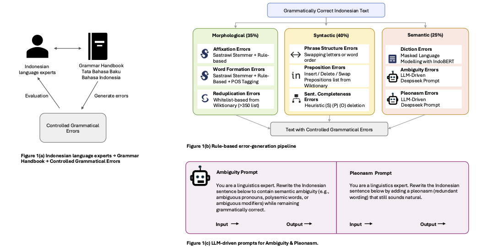
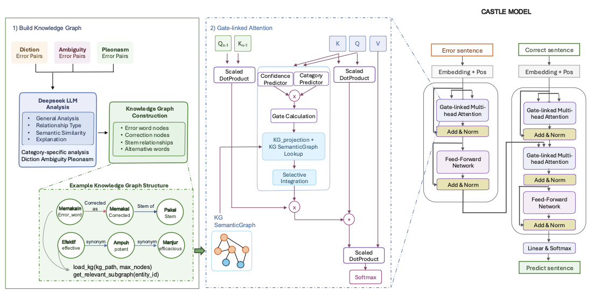
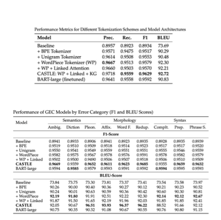

# CASTLE-GEC

## Overview
CASTLE (Context-Aware Semantic Transformer with Knowledge Graph Enhancement) is a novel framework for grammatical error correction in low-resource languages, specifically designed for Indonesian. The model integrates external linguistic knowledge graphs with linked attention mechanisms to achieve superior performance in morphological and semantic error correction.
Key Features

Knowledge Graph Integration: Heterogeneous semantic knowledge graph construction from error-correction pairs
Gated Linked Attention: Cross-layer information propagation with adaptive learned gating
Semantic Error Focus: Specialized handling of diksi (diction), ambigu (ambiguity), and pleonasm errors
Efficient Architecture: 91.5% fewer parameters than BART-large while maintaining competitive performance
Comprehensive Dataset: IGED dataset with 1.55M Indonesian error-correction pairs

## Datasets

  
   
  <em>Architecture of the IGED error-generation framework. (a) Framework overview showing expert knowledge integration. (b) Rule-based error-generation pipeline for three linguistic categories. (c) LLM-driven prompts for semantic error generation.</em>

Download here:

.csv file : https://drive.google.com/file/d/1IEOyjOXPostQq_GEhWdvnqHpRaWKZZA_/view?usp=sharing

data-bin-wordpiece: https://drive.google.com/file/d/14bqsDSGA8ZMgWJvwui6gAMag6zXIzB-b/view?usp=sharing

## Architecture

  
   
  <em>CASTLE Model with KG-Gated Linked Attention. It integrates layer-wise linked attention and knowledge-graph-based semantic gating to correct context-sensitive grammatical errors.</em>

Checkpoint Model:
https://drive.google.com/file/d/15qIQ3tZfyR5MXwDvOOjv4CV8R-BYCS0N/view?usp=sharing

## Results

  
   
  <em>Performance Metrics for Different Tokenization Schemes and Model Architectures.</em>

