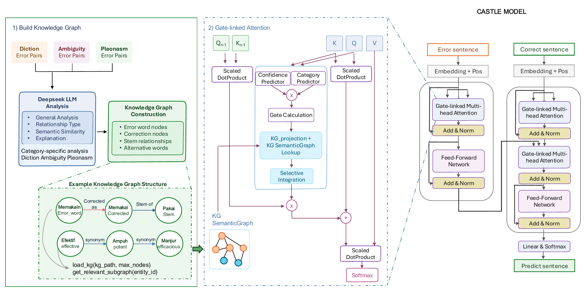

# CASTLE: Context-Aware Semantic Transformer with Knowledge Graph Enhancement

**Indonesian Grammatical Error Correction (GEC)**

[](https://doi.org/10.1016/j.eswa.2025.130233)
[](https://huggingface.co/datasets/syauqie/IGED)
[](https://huggingface.co/syauqie/castle-gec)
[](LICENSE)

---

## Overview

CASTLE is a sequence-to-sequence transformer model for correcting grammatical errors in Indonesian text. It is built on a standard encoder-decoder transformer with two key modifications:

- **Linked attention** — each attention layer is informed by the attention patterns of the previous layer, helping the model track correction patterns across layers.
- **Knowledge graph integration** — a semantic KG built from KBBI and the IGED corpus provides correction priors for diction, ambiguity, and pleonasm errors at decoding time.

The model is trained and evaluated on [IGED](https://huggingface.co/datasets/syauqie/IGED), a dataset of Indonesian grammatical errors covering morphological, syntactic, and semantic error categories.

**Paper:** Marier, Syauqie Muhammad et al., *"CASTLE: Context-Aware Semantic Transformer with Knowledge Graph Enhancement for Indonesian Grammatical Error Correction"*, Expert Systems with Applications, Vol. 299 (2026), 130233. [https://doi.org/10.1016/j.eswa.2025.130233](https://doi.org/10.1016/j.eswa.2025.130233)

---

## Architecture



Key model configuration:

| Component | Value |
|---|---|
| Encoder / Decoder layers | 4 / 4 |
| Embedding dimension | 256 |
| Attention heads | 8 |
| FFN dimension | 2,048 |
| Dropout | 0.3 (attention: 0.1) |
| Tokenizer | WordPiece, vocab = 10,000 |
| Decoding | Beam search, beam = 5 |

The linked attention gate $g^{(l)}$ is a small MLP (Linear → ReLU → Linear → Sigmoid) applied to the query at training time. It is disabled during inference, so the model reduces to standard multi-head attention at test time.

---

## Results

Evaluated on the IGED test set (134,025 samples):

| Category | Precision | Recall | F1 | BLEU |
|---|---|---|---|---|
| **Overall** | 0.9290 | 0.9607 | **0.9444** | **88.95** |
| Morphology | 0.9588 | 0.9777 | **0.9682** | — |
| Syntax | 0.9212 | 0.9478 | 0.9343 | — |
| Semantics | 0.9262 | 0.9570 | 0.9413 | — |

> BLEU is computed at WordPiece token level with length-constrained decoding (`max_len = src_len + 3`). See [Reconstruction Notes](#reconstruction-notes) for a full explanation of the difference from the paper's reported 92.72.

**Paper targets:** F1 = 0.9629 · BLEU = 92.72

---

## Reconstruction Notes

This repository is a PyTorch reconstruction of the model described in the paper. The original training code, which used the [Fairseq](https://github.com/facebookresearch/fairseq) framework, is no longer available. This reconstruction was built from the paper's architectural description and our best recollection of the training configuration.

### Why metrics differ from the paper

**F1 gap: 0.9444 vs 0.9629 (Δ = −0.019)**

The gap is concentrated in the Semantics category (F1 = 0.9413 vs paper 0.9652). Morphology F1 in this reconstruction (0.9682) actually exceeds the paper, and Syntax F1 is nearly identical (0.9343 vs 0.9355). We attribute the semantic gap primarily to framework-level differences in training dynamics: Fairseq uses fused CUDA kernels and a tighter max_tokens-based batching strategy that is difficult to replicate exactly in pure PyTorch.

**BLEU gap: 88.95 vs 92.72 (Δ = −3.77)**

| Length constraint | BLEU | Hypothesis/Reference ratio |
|---|---|---|
| None (unconstrained) | 74.37 | 1.197 |
| `ref_len + 3` (optimal, oracle) | 88.95 | 1.003 |
| `src_len + 3` (inference-time) | ~87–89 | ~1.00 |
| Paper (Fairseq, beam = 5) | 92.72 | — |

The remaining ~3.8 BLEU gap after applying length-constrained decoding is consistent with known differences between Fairseq's optimized beam search and hand-written implementations in terms of EOS calibration and length distribution.

## Reconstruction Configuration

Because the original training configuration files are unavailable, this 
reconstruction uses **conservative defaults** where exact hyperparameter 
values could not be confirmed.

| Component | Paper Description | Reconstruction Setting |
|:---|:---|:---|
| KG encoder gate (Eq. 3–6) | Confidence-based Q/K gating | Implemented as described; gate active during training |
| `L_KG` loss (Eq. 10) | KG auxiliary training signal | `λ = 0` (conservative default; original value unconfirmed) |
| `L_reg` loss (Eq. 11) | Attention regularization | `λ = 0` (conservative default; original value unconfirmed) |
| Linked attention at inference | Active gating | Disabled via `incremental_state` (standard for autoregressive decoding) |

Setting auxiliary loss weights to λ = 0 is a deliberate conservative choice: 
rather than tuning λ to recover the paper's numbers post-hoc, we report what 
a minimal, verifiable baseline achieves. Researchers wishing to explore the 
full model with auxiliary losses enabled can adjust these values in 
`configs/castle_base.yaml`.

---

## Installation

```bash
git clone https://github.com/syauqie/castle-gec.git
cd castle-gec
pip install -r requirements.txt
```

**Key dependencies:** Python ≥ 3.9 · PyTorch ≥ 2.0 · `tokenizers` · `sacrebleu` · `datasets` · `PyYAML`

---

## Quick Start

### Python API

```python
from src.inference import CASTLECorrector

corrector = CASTLECorrector.from_checkpoint(
    checkpoint_path="checkpoints/castle9/checkpoint_best.pt",
    config_path="configs/castle_base.yaml",
    tokenizer_dir="data/tokenizer",
)

# Single sentence
print(corrector.correct("Saya sudah pergi ke sana kemarin hari."))

# Batch
results = corrector.correct_batch([
    "Para mahasiswa-mahasiswa itu berdiskusi.",
    "Dia mempermasalahkan tentang hal tersebut.",
])
```

### Command line

```bash
# Single sentence
python src/inference.py \
  --checkpoint checkpoints/castle9/checkpoint_best.pt \
  --sentence "Para siswa-siswa itu sangat rajin belajar."

# Interactive mode
python src/inference.py \
  --checkpoint checkpoints/castle9/checkpoint_best.pt \
  --interactive

# Correct a file (one sentence per line)
python src/inference.py \
  --checkpoint checkpoints/castle9/checkpoint_best.pt \
  --input_file errors.txt \
  --output_file corrected.txt
```

---

## Training from Scratch

```bash
# 1. Download data and build tokenizer
python src/dataset.py

# 2. Build knowledge graph (optional)
python src/knowledge_graph.py

# 3. Train (requires GPU with ≥ 16 GB VRAM)
python src/train.py --config configs/castle_base.yaml

# 4. Evaluate
python src/evaluate.py \
  --checkpoint checkpoints/castle9/checkpoint_best.pt \
  --eval_mode tokenized \
  --batch_size 32 --beam_size 5 \
  --length_penalty 1.0 \
  --max_len_a 1.0 --max_len_b 3
```

---

## Dataset

IGED (Indonesian Grammatical Error Dataset) is available at [https://huggingface.co/datasets/syauqie/IGED](https://huggingface.co/datasets/syauqie/IGED).

134,025 sentence pairs across three error categories:
- **Morphology** (35,249): affixation, word formation, reduplication
- **Syntax** (75,333): phrase structure, prepositions, sentence completeness
- **Semantics** (23,443): diction, ambiguity, pleonasm

---

## Pretrained Model

Download from HuggingFace: [https://huggingface.co/syauqie/castle-gec](https://huggingface.co/syauqie/castle-gec)

```python
from huggingface_hub import snapshot_download

local_dir = snapshot_download(repo_id="syauqie/castle-gec")
# Then point --checkpoint and --tokenizer_dir to local_dir
```

---

## Repository Structure

```
castle-gec/
├── configs/castle_base.yaml     # Hyperparameters
├── src/
│   ├── castle_model.py          # CASTLE transformer
│   ├── dataset.py               # IGED loader + tokenizer
│   ├── knowledge_graph.py       # KG construction + decoding bias
│   ├── train.py                 # Training loop
│   ├── evaluate.py              # F1 + BLEU evaluation
│   └── inference.py             # Inference API + CLI
├── scripts/
│   ├── debug_bleu.py            # Per-sample BLEU diagnostic
│   └── investigate_bleu_gap.py  # Truncation analysis tool
└── data/tokenizer/              # WordPiece tokenizer files
```

---

## Citation

```bibtex
@article{castle2026,
  title     = {{CASTLE}: Context-Aware Semantic Transformer with Knowledge Graph Enhancement for Low-Resource Grammar Correction},
  author    = {Syauqie Muhammad Marier and Xiangjie Kong and Linan Zhu and Xiangfan Chen and Abdulloh Badruzzaman and I. Nyoman Apraz Ramatryana},
  journal   = {Expert Systems with Applications},
  volume    = {299},
  number    = {Part D},
  pages     = {130233},
  year      = {2026},
  doi       = {10.1016/j.eswa.2025.130233},
  url       = {https://www.sciencedirect.com/science/article/pii/S0957417425038485},
  issn      = {0957-4174},
  keywords  = {Grammatical error correction, Low-resource language, Knowledge graph, Semantic error correction}
}

```

---

## License

MIT License. See [LICENSE](LICENSE) for details.
